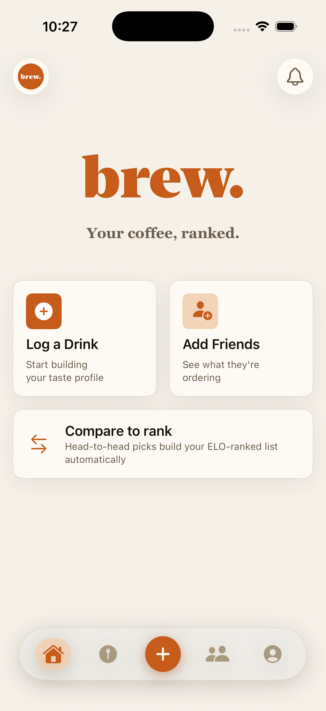
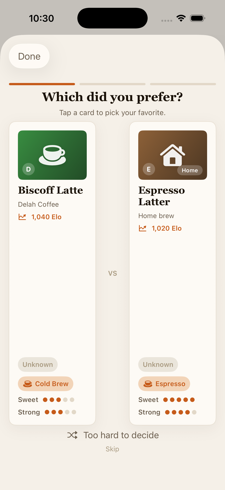
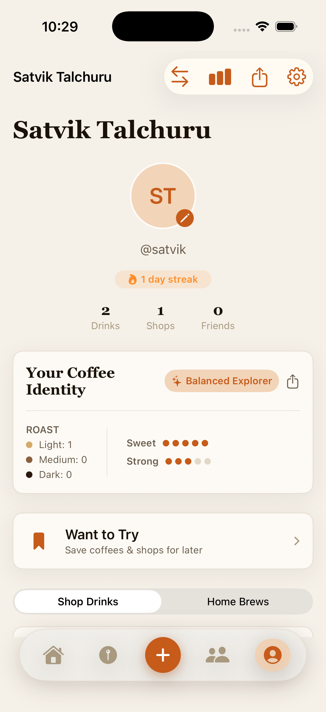
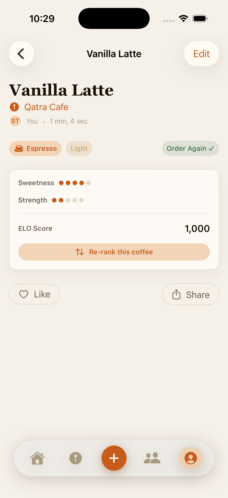
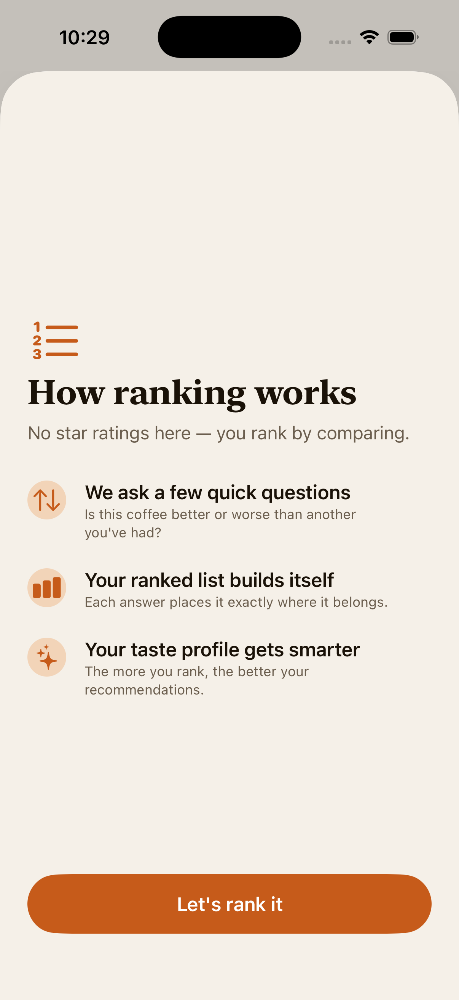
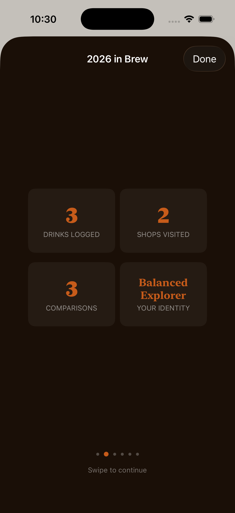

# Brew

Brew is a native iOS app for logging coffee and tea, ranking drinks with
head-to-head comparisons, and building a personal taste profile over time.

Instead of star ratings, Brew uses pairwise choices: after logging a drink,
users can compare it with another drink they have tried. Those comparisons
feed an Elo-style ranking so the app reflects preference, not just one-off
satisfaction.

## Features

- Log cafe drinks, tea, espresso, and home brews
- Rank drinks through head-to-head comparisons
- Track taste preferences for sweetness, strength, roast, and flavor tags
- Discover nearby cafes with MapKit
- Save drinks and shops to a wishlist
- View friends' activity, likes, suggestions, and coffee chat requests
- Block/report users and delete an account in app

## Demo

| Home | Ranking | Profile |
|---|---|---|
|  |  |  |

| Drink Detail | Ranking Intro | Year in Brew |
|---|---|---|
|  |  |  |

## Tech Stack

- **UI:** SwiftUI, iOS 17+
- **State:** Observation framework (`@Observable`)
- **Backend:** Supabase Auth, Postgres, Storage, and Row Level Security
- **Networking:** `URLSession` against Supabase REST/Auth APIs
- **Location/Places:** MapKit and CoreLocation
- **Project generation:** XcodeGen via `project.yml`

The app does not use analytics, ads, or third-party iOS SDKs.

## Requirements

- Xcode with an iOS 17+ simulator/runtime
- XcodeGen
- A Supabase project
- An Apple Developer team for device/App Store builds

Install XcodeGen if needed:

```bash
brew install xcodegen
```

## Local Setup

1. Generate the Xcode project:

   ```bash
   xcodegen generate --spec project.yml
   ```

2. Open the project:

   ```bash
   open Brew.xcodeproj
   ```

3. Select your Apple Development Team in Xcode if building for a device.

4. Run `BrewApp` on a simulator or device.

For simulator-only builds, signing can be disabled from the command line:

```bash
xcodebuild \
  -project Brew.xcodeproj \
  -scheme BrewApp \
  -destination 'platform=iOS Simulator,name=iPhone 15' \
  CODE_SIGNING_ALLOWED=NO \
  build
```

## Supabase Setup

Run the SQL files in `supabase/` in this order from the Supabase Dashboard
SQL Editor:

1. `supabase/supabase_schema.sql`
2. `supabase/supabase_shops.sql`
3. `supabase/supabase_wishlist.sql`
4. `supabase/supabase_suggested_friends.sql`
5. `supabase/supabase_app_store_compliance.sql`
6. `supabase/supabase_hardening.sql`
7. `supabase/supabase_fix_signup_trigger.sql`
8. `supabase/supabase_avatar_storage.sql`

Then configure Supabase Auth:

- Enable email/password auth.
- Add `brew://confirmed` to allowed redirect URLs if email confirmation is enabled.
- Confirm the public Data API can access the `public` schema tables used by the app.

The app's Supabase URL and anon key are currently defined in
`BrewApp/Services/SupabaseService.swift` (`SupabaseConfig`). The anon key is
safe to ship in an iOS client when Row Level Security policies are correct.

## Project Layout

```text
BrewApp/
  App/              App entry point and root navigation
  Data/             AppStore, remote mapping, sync, offline write queue
  DesignSystem/     Theme and reusable UI components
  Logic/            Ranking, Elo, recommendations, taste profile
  Models/           Shared app models
  Screens/          SwiftUI screens
  Services/         Auth, Supabase, location, places, notifications, keychain
  Assets.xcassets   App icon and launch assets

BrewAppTests/       Unit and smoke tests
docs/               GitHub Pages privacy page
supabase/           Backend setup SQL scripts
project.yml         XcodeGen project definition
```
